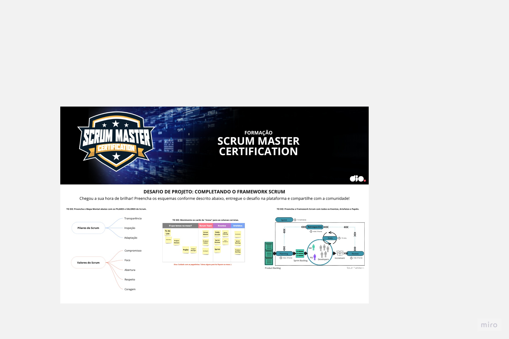

## Desafio 1 - Formação Scrum Master Certification

### Detalhes do Desafio

- Criar uma conta no Miro: https://miro.com/pt/
- Acessar o link do Template do Miro. [Link](https://miro.com/app/board/uXjVPahls68=/?share_link_id=956189813435)
- Duplicar o Template para sua conta
- Preencher os esquemas conforme as instruções
- Exportar o seu resultado (PDF, Imagem, etc)
- Entregar o Projeto via repositório no GitHub

### Resolução

